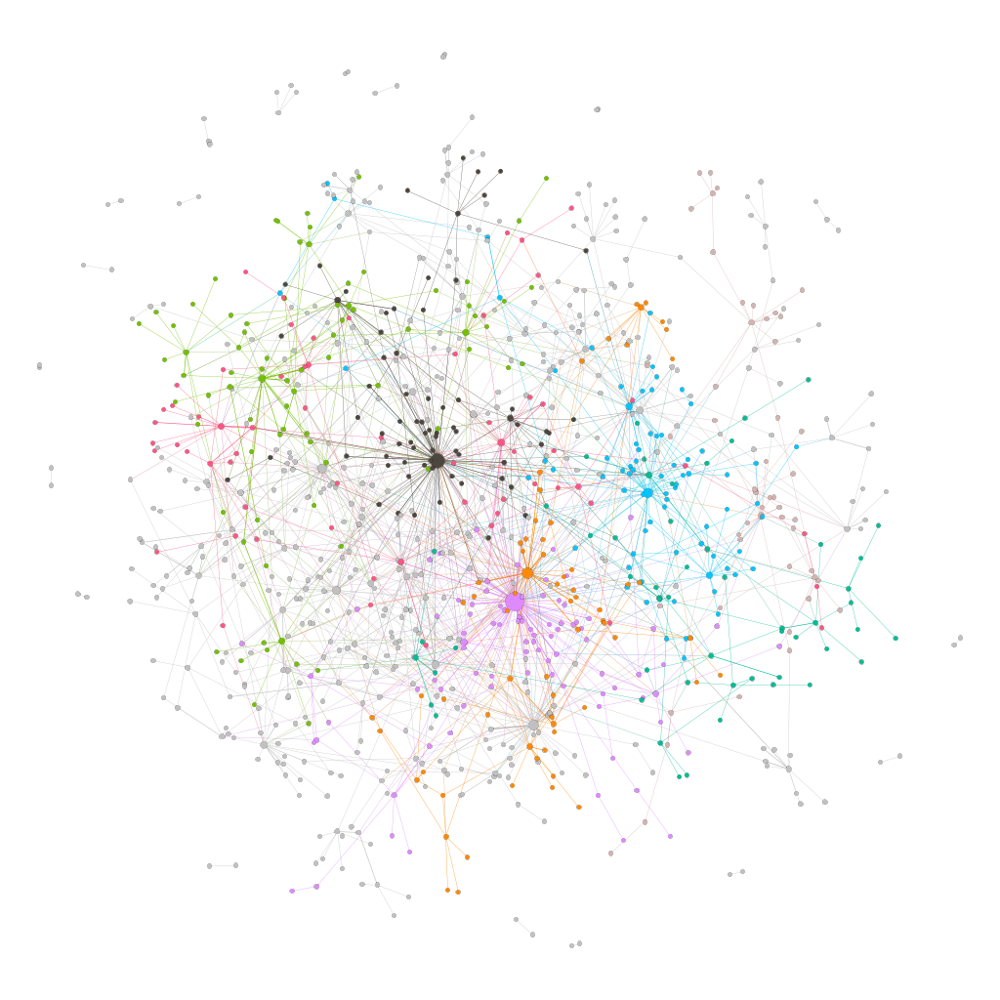

# Brain Network Analysis

A simple network analysis on a mouse brain dataset.

`Margherita Pindaro **923178**`

📓 [Notebook](Mouse_Brain_Network.ipynb)

📑 [Slide](https://docs.google.com/presentation/d/1aqxUvFG9aSi2hyIW6l3xtQtcFJmn-ZkHc8LuafH5Xnw/edit?usp=sharing&resourcekey=0-TPcVOTWPNpM9NeFthLST3g)

🎞️ [Registrazione](https://drive.google.com/file/d/1Do2oSJVY7xwDf_oEm5Gbxibp-Tmivsw0/view?usp=sharing)

Visualizzazione tramite Gephi delle community del dataset tramite community detection basata su modularity. Eh già, non è a forma di cervello

## References

[Dataset](http://networkrepository.com/bn-mouse-kasthuri-graph-v4.php)

[Fundamentals of Brain Network Analysis](https://www.sciencedirect.com/book/9780124079083/fundamentals-of-brain-network-analysis)

[The Network Data Repository with Interactive Graph Analytics and Visualization](https://www.researchgate.net/publication/321137237_The_Network_Data_Repository_with_Interactive_Graph_Analytics_and_Visualization)

[Structure and function of complex brain networks](https://www.ncbi.nlm.nih.gov/pmc/articles/PMC3811098/)

---
👉🏻 [Bonus: I Don't Like Notebooks - Joel Grus](https://docs.google.com/presentation/d/1n2RlMdmv1p25Xy5thJUhkKGvjtV-dkAIsUXP-AL4ffI/edit?usp=sharing)